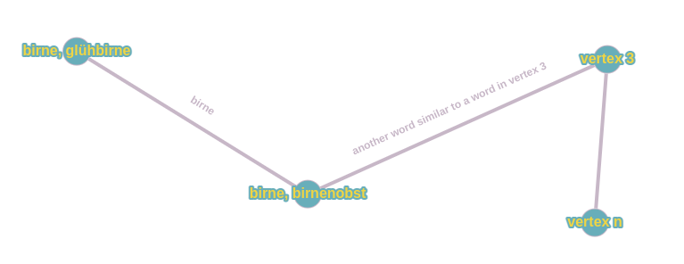

# German_language_synonym_patterns

Context:

Languages sometimes offer different word for the same symbol. This is widely known as synonyms. Furthermore, there 
are words, which can be used for differents things depending on the context the speaker uses them. This Python codes 
builds a graph with synonym sets as vertices and connects vertices including one or more same words with edges. 
A shortest path algorithm (dijekstra implemented) can be used to find the shortest way from one word to another 
with the help of their individual synonyms. A small picture shall help to understand the idea.

The german language is used with a synonym dataset from https://www.openthesaurus.de/

Usage:

The main function includes examples with different pairs of words, which can be changed by the user. Call the 
Script main.py and see the output in the console. The example below shows the console output for the pair (Fessel, Zettel)

Example:

Basic Information  
start word is found in 3 different word-patterns
end word is found in 2 different word-patterns
Strting Node:
blatt
Task:
Finde den kürzesten Weg zum Wort: fessel
blatt ist ein Synonym von ['zettel']
Das Wort zettel im Kontext von ['papierblatt', 'blattpapier', 'papier', 'zettel', 'fetzenpapier', 'seite', 'wisch', 'bogen', 'blatt'] wird auch als ['zettel'] Im Kontext von ['aufzug', 'werft', 'zettel', 'kettfaden', 'kette'] verwendet
Das Wort kette ist ein Synonym des Wortes {'zettel'} in diesem neuen Kontext
Das Wort kette im Kontext von ['aufzug', 'werft', 'zettel', 'kettfaden', 'kette'] wird auch als ['kette'] Im Kontext von ['handfessel', 'kette', 'handschelle', 'fessel'] verwendet
Das Wort fessel ist ein Synonym des Wortes {'kette'} in diesem neuen Kontext
Das Wort fessel im Kontext von ['handfessel', 'kette', 'handschelle', 'fessel'] wird auch als ['fessel'] Im Kontext von ['fußgelenk', 'fußknöchel', 'fessel', 'knöchel'] verwendet
{'fessel'} ist ein Synonym von fessel im neu gewählten Kontext
Endknoten gefunden (fessel)

